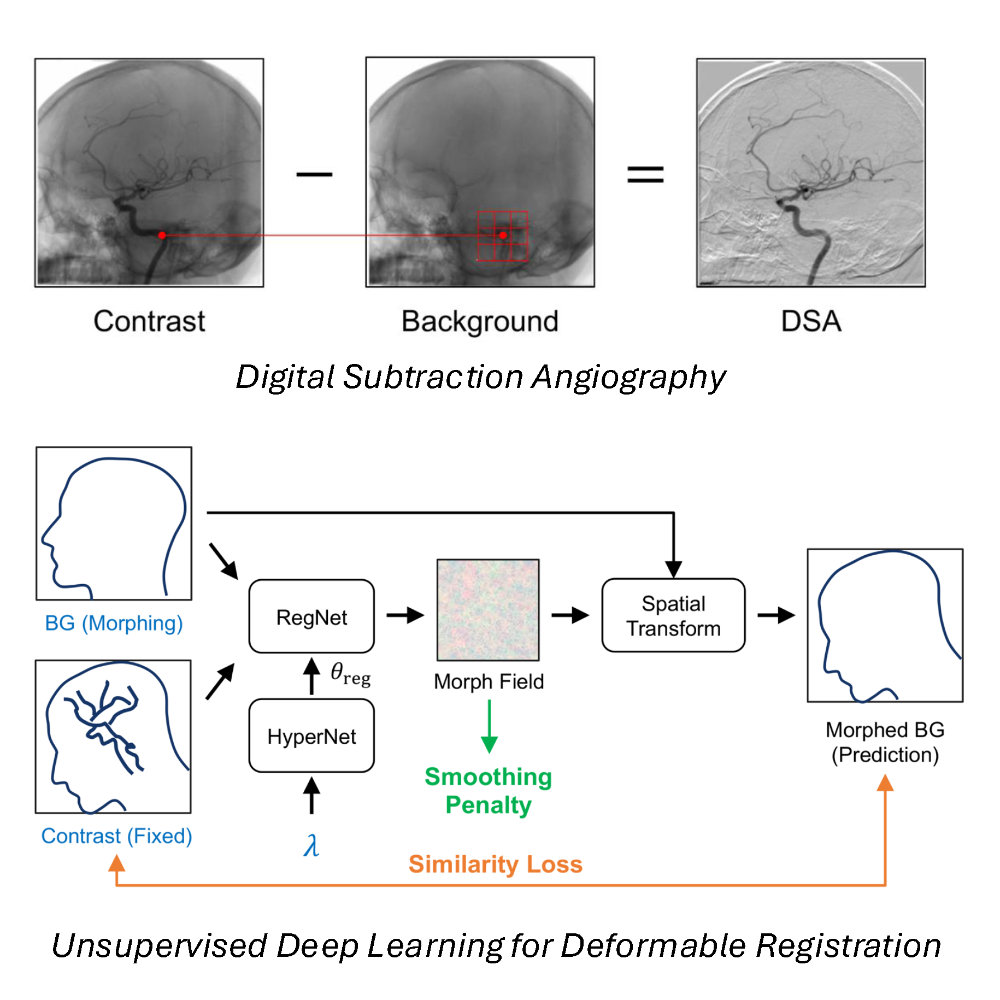
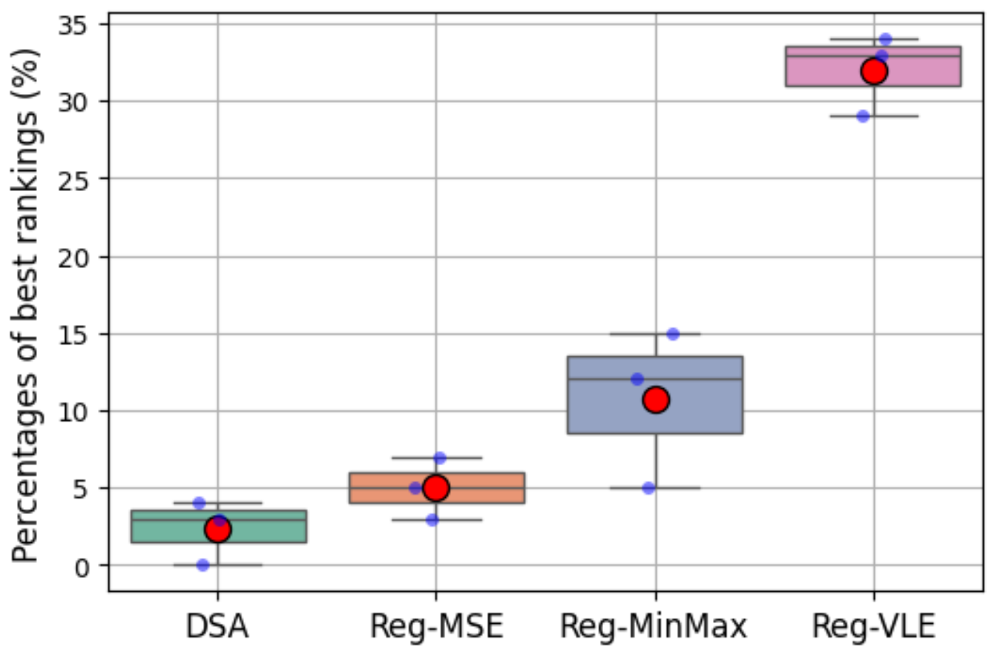

---
title: "Unsupervised Deep Learning–Based Deformable Registration for Angiographic Background Subtraction"
date: 2026-02-04
authors:
  - admin
tags:
  - image-processing-and-analysis
categories:
  - research
summary: "We apply unsupervised deep learning to learn non-rigid registration fields for angiographic background subtraction and compare MSE, MinMax, and VLE similarity losses."
math: true
draft: false
share: false
---

## Overview

Recently, new deep learning-based, fast, deformable, diffeomorphic registration methods have been developed for a variety of image registration tasks. In the context of registration learning, diffeomorphism guarantees the smoothness and continuity of the learned morph fields, which can be achieved either by the integration of a continuous velocity field or by penalizing the gradient of the morph field. Prominent among these methods is VoxelMorph, a state-of-the-art unsupervised learning framework for deformable image registration, originally developed for the co-registration of 3D MRI brain scans. VoxelMorph consists of a U-Net that takes two images or volumes as input and generates a morph field that maps the moving image or volume onto the fixed image or volume. The loss function for the VoxelMorph training framework is a combination of an image similarity loss and a penalty on the spatial gradient of the morph field, weighted by a hyperparameter \(\lambda\). For efficient hyperparameter tuning, Hoopes et al. extended the framework by introducing a hypernetwork (HyperNet) that takes \(\lambda\) as input and outputs the weights and biases of the registration network (RegNet), which in turn takes the two images or volumes as input and produces the optimal deformation field corresponding to the input hyperparameter value. The hypernetwork can be trained simultaneously with the registration network, and this combined framework is referred to as HyperMorph.

## Unsupervised Deep Learning Framework

We employ HyperMorph, an unsupervised deep learning framework to learn the non-rigid registration fields \(\phi\) that map the background frame \(I_{BG}\) onto the post-contrast angiographic frames \(I_{C}\), as illustrated in Fig. 1. The background frame and a single post-contrast frame are provided to the RegNet, which utilizes a U-Net architecture (with 16, 32, 32, 32 encoder features and 32, 32, 32, 32, 32, 16, 16 decoder features; in total, 14M trainable parameters), and learns the non-rigid morph field \(\phi\) of the background frame (moving image) relative to the contrast frame (fixed image). Subsequently, the learned morph field \(\phi\) is applied to the input background frame \(I_{BG}\), yielding the morphed background frame, denoted by \(I_{BG}' = I_{BG} \circ \phi\), which is the final output of the full deep learning framework (Fig. 1). Background subtraction can then be performed: \(BSA_{reg} = I_{C} - I_{BG}'\).

<figure style="margin: 1.25rem 0; text-align: center;">
  
  <figcaption style="margin-top: 0.25rem; text-align: left;">
    <strong>Fig. 1</strong>: <em>Upper</em>: Illustration of traditional digital subtraction angiography (DSA) (ie, $DSA = I_{C} - I_{BG}$), in which the background image ($I_{BG}$) is subtracted from subsequent postcontrast frames ($I_{C}$) recorded after contrast injection. Misregistration artifacts can arise from patient motion. During iterative vessel layer estimation, the red marker illustrates the detection of injected contrast by comparing the central pixel value in the contrast frame to the neighborhood of surrounding values in the background frame (e.g., a 3 x 3 pixel patch). <em>Lower</em>: Hypermorph unsupervised deep learning framework for registration of background (BG) and post-contrast angiographic frames. The background and post-contrast frames are supplied to RegNet, which predicts a morph field of the background frame relative to the contrast frame. The RegNet weights are determined by HyperNet, which takes a single hyperparameter $0 \leq \lambda \leq 1$ as input. The morphed background prediction is obtained by applying the morph field to the input background frame. The total loss is a weighted sum of image similarity and a penalty on the spatial gradient of the morph field. HyperNet and RegNet can be trained simultaneously.
  </figcaption>
</figure>

## Loss Formulation

To train the unsupervised learning framework, the total loss function consists of a scaled image similarity loss \(\mathcal{L}_{sim}/\alpha_{sim}^{2}\) and a smoothing penalty \(\mathcal{L}_{smooth}\):

$$
\mathcal{L} = (1 - \lambda)\frac{\mathcal{L}_{sim}\left( I_{BG}',\ I_{C} \right)}{\alpha_{sim}^{2}} + \lambda\mathcal{L}_{smooth}(\phi) \tag{1}
$$

where \(0 \leq \lambda \leq 1\) determines the relative weight between the image similarity loss and the smoothing penalty. \(\lambda\) is the only input to HyperNet, which is a multi-layer perceptron (consisting of 4 fully-connected layers with 32, 64, 128, 128 features and ReLU activations; in total, 27K trainable parameters), and generates the weights and biases \(\theta_{reg}\) of the RegNet (Fig. 1). We set the scaling parameter \(\alpha_{sim} = 0.3\), such that \(\mathcal{L}_{sim}/\alpha_{sim}^{2}\) and \(\mathcal{L}_{smooth}\) have approximately equivalent magnitude when \(\lambda = 0.5\).

Smoothness of the registration field can be enforced by minimizing the magnitude of the spatial gradient of the morph field:

$$
\mathcal{L}_{smooth}(\phi) = \frac{1}{2}\left\| \nabla \phi \right\|^{2} \tag{2}
$$

We evaluated multiple image similarity loss functions \(\mathcal{L}_{sim}\) for our task. Notably, we aim to register a non-contrast background frame onto an image with post-contrast vascular densities, introducing a form of spatially heterogenous domain translation on top of the registration task. For this reason, we develop loss functions that strongly weight the bone and soft tissue densities that are common to both frames while simultaneously reducing the impact of regions with injected contrast.

### Registration with MSE Similarity Loss (Reg-MSE)

Our baseline model utilizes mean squared error (MSE), as in HyperMorph, to evaluate the image similarity between the morphed background frame \(I_{BG}'\) and the fixed contrast frame \(I_{C}\):

$$
\mathcal{L}_{sim}(I_{BG}',\ I_{C}) = MSE\left( I_{BG}',\ I_{C} \right) = \left\| I_{BG}' - I_{C} \right\|^{2} \tag{3}
$$

### Registration with MinMax Similarity Loss (Reg-MinMax)

The MSE loss cannot differentiate between 1) bone and soft tissue densities that are common to both frames and 2) the vascular densities that are present in only the post-contrast frame. As demonstrated in our experiments, this makes the MSE loss prone to overfitting the injected contrast by introducing large displacements that move adjacent bone into nearby vascular densities to minimize the MSE.

To create an image similarity loss function that is robust to the presence of vascular densities, we attempt to separate the vessels from the background bone and soft tissue densities prior to applying an MSE loss. In our angiographic X-ray images, iodinated contrast will always increase the density and result in pixels that are darker than the background alone. Thus, the two pixel-wise operations \(\min( I_{BG}',\ I_{C} )\) and \(\max( I_{BG}',\ I_{C} )\) produce images with and without vascular densities, respectively. As registration improves during model training, the image with vascular densities will more accurately match the contrast frame \(I_{C}\), and the image without vascular densities will more accurately match the morphed background frame \(I_{BG}'\). This training objective is formulated mathematically as a MinMax loss:

$$
\mathcal{L}_{sim}\left( I_{BG}',\ I_{C} \right) = \frac{MSE\left( \min( I_{BG}',\ I_{C} ),\ I_{C} \right) + MSE\left( \max( I_{BG}',\ I_{C} ),\ I_{BG}' \right)}{2} \tag{4}
$$

### Registration with Vessel Layer Estimation (Reg-VLE)

In an alternative approach, we propose an image similarity loss function that evaluates the MSE between the morphed background frame \(I_{BG}'\) and the fixed contrast frame \(I_{C}\) after exclusion of an iteratively refined estimate of the vessel layer \(L_{vessel}\). This image similarity loss is expressed as:

$$
\mathcal{L}_{sim}\left( I_{BG}',\ I_{C} \right) = MSE\left( I_{BG}',\ I_{C} - L_{vessel} \right) \tag{5}
$$

To isolate the vessel layer, we perform an anomaly detection step, in which the vascular densities are identified by their low intensity. As illustrated in Fig. 1, we compare the value of a pixel in the post-contrast frame to the values within the neighborhood (e.g., a patch with 3 x 3 pixels) of the corresponding pixel in the background frame. If the pixel value of the contrast frame is less than all pixel values in the corresponding neighborhood of the background frame, it suggests that the low density of the pixel in the post-contrast frame is due to contrast injection. With this in mind, the separated vessel layer can be formulated as:

$$
L_{vessel} = \left( I_{C} - I_{BG}' \right) * \mathbf{1}\left( I_{C} < \min\_pool\left( I_{BG}' \right) \right) \tag{6}
$$

where \(I_{C} - I_{BG}'\) is the BSA with registration learning. \(*\) denotes pixel-wise multiplication. \(\mathbf{1}(condition)\) is a pixel-wise indicator function, which returns 1 if the condition is satisfied and 0 otherwise. \(\min\_pool\left( I_{BG}' \right)\) represents the minimum pooling of \(I_{BG}'\) with a kernel size of 3 x 3, a stride of 1, and same padding. The output has the same shape as \(I_{BG}'\), and is equivalent to obtaining the minimal values in all 3 x 3 patches centered at each pixel of \(I_{BG}'\).

## Model Training

Each model (Reg-MSE, Reg-MinMax, and Reg-VLE) was trained on a dataset consisting of 5046 angiographic series over 10 dataset-level epochs (Fig. 2). For each series-level training iteration in each epoch, 50 frames were randomly selected with replacement from each of the 5046 angiographic series, and the model was trained on these 50 frames. This random selection of a fixed number of frames was employed to reduce overfitting or overweighting of any single angiographic series, as some series contain many more frames than others. Overall, there are 50,460 series-level iterations across the 10 dataset-level epochs, constituting 2,523,000 frame-level iterations.

During the training process, we manually examined the model outputs, and observed overfitting with excessive local warping (accordingly, causing new artifacts in the vessel regions of BSA images) at smaller smoothing penalties \(\lambda\) and at longer training durations. Conversely, regularization of the model outputs could be achieved with larger smoothing penalties and shorter training durations. Furthermore, longer training durations required larger magnitudes of \(\lambda\) to suppress overfitting but did not substantially improve BSA image quality. As a result of this observation, and to reduce the computational cost, we performed regularization by early stopping at 10 dataset-level epochs, and then subsequently chose the optimal \(\lambda\) hyperparameter. On a single RTX A6000 GPU, the training duration with 2,523,000 frame-level iterations was approximately 4 days for each model. Future work may be performed to more thoroughly characterize the interaction between training duration and the optimal magnitude of \(\lambda\).

<figure style="margin: 1.25rem 0; text-align: center;">
  
  <figcaption style="margin-top: 0.25rem; text-align: left;">
    <strong>Fig. 2</strong>: Learning curves for the Reg-MSE (a), Reg-MinMax (b), and Reg-VLE (c) BSA models. The loss is the weighted sum of the image similarity loss and the smoothing penalty loss (Eq. 1).
  </figcaption>
</figure>

## Model Evaluation

After training, we evaluated the performance of learning-based BSA (ie, $BSA_{reg} = I_{C} - I_{BG}'$⁠) compared to the traditional DSA algorithm (ie, $DSA = I_{C} - I_{BG}$⁠) on the hold-out test set. First, we identified the best learning-based BSA model by algorithm ranking. Images generated by 4 competing algorithms were presented to 3 board-certified interventional neuroradiologists (with 2, 4, and 14 years of postfellowship experience) in a random order, as shown in Figure 3. The raters were blinded to the processing methods and were asked to rank the angiograms based on overall quality. Statistical analysis was performed using a nonparametric Friedman test followed by a post hoc Conover test to adjust for multiple comparisons. During review, the radiologists were also asked to note any new artifacts that they believed were introduced by postprocessing, aside from traditional motion-based misregistration. 

<figure style="margin: 1.25rem 0; text-align: center;">
  
  <figcaption style="margin-top: 0.25rem; text-align: left;">
    <strong>Fig. 3</strong>: Randomized BSA series generated using alternative algorithms for expert ranking, and corresponding morph fields of each BSA image (not presented to the radiologists). For the morph fields, the arrow directions are indicated by colors, i.e., toward left (blue) or right (green). Top-Left (TL): Reg-MSE; Top-Right (TR): Reg-MinMax; Bottom-Left (BL): traditional DSA; Bottom-Right (BR): Reg-VLE. Arrows in the Top-Left Reg-MSA frame demonstrate new artifacts introduced by large local warp fields. Arrows in the Top-Right Reg-MinMax demonstrate residual misregistration artifact.
  </figcaption>
</figure>

Fifty angiographic series in the hold-out test set were processed using traditional DSA, Reg-MSE BSA, Reg-MinMax BSA, and Reg-VLE BSA, respectively. The average BSA inference time on our hardware was 30 milliseconds per frame for the 3 models, which have the same architecture and differ only in the training loss function (ie, MSE, MinMax, and VLE losses). As shown in Figure 4, the Reg-VLE BSA algorithm was ranked highest in 64.0 ± 5.3% of the samples, significantly superior (P < .05) to the alternative algorithms (Reg-MinMax: 21.3 ± 10.3%, Reg-MSE: 10.0 ± 4.0%, and DSA: 4.7 ± 4.2%). 

All series flagged for the presence of postprocessing artifacts were generated by the Reg-MSE BSA algorithm (16 of 50 studies in total). As previously discussed, these artifacts result from local distortions that arise when the RegNet attempts to displace adjacent bone densities into prominent vessels to minimize the global MSE loss (Figure 3-TL). No such artifacts were reported in the Reg-MinMax or Reg-VLE algorithms, which are designed to be robust to the variable presence of vascular densities. For a detailed evaluation of model performance, please refer to the original paper [1].

<figure style="margin: 1.25rem 0; text-align: center;">
  
  <figcaption style="margin-top: 0.25rem; text-align: left;">
    <strong>Fig. 4</strong>: Boxplot showing percentages that the alternative algorithms were ranked "best" by 3 practicing interventional neuroradiologists. Red circles represent the means. Reg-VLE is significantly better than Reg-MinMax (P = .037), Reg-MSE (P = .0027), and DSA (P = .00030). Reg-MinMax is significantly better than DSA (P = .0073). Abbreviation: DSA = digital subtraction angiography.
  </figcaption>
</figure>

## References

1. Chaochao Zhou, Ramez N Abdalla, Dayeong An, Syed H A Faruqui, Teymour Sadrieh, Mohayad Alzein, Rayan Nehme, Ali Shaibani, Sameer A Ansari, Donald R Cantrell, "Reducing motion artifacts in craniocervical background subtraction angiography with deformable registration and unsupervised deep learning," *Radiology Advances*, Volume 1, Issue 3, September 2024, umae020, https://doi.org/10.1093/radadv/umae020
